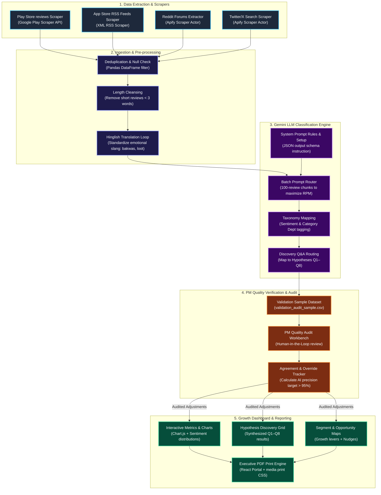

# 🛠️ Blinkit Growth Discovery Engine: AI Pipeline Workflow
**Mermaid Flowchart of the Multi-Channel Data Extraction, Classification, Audit & Visualization Pipeline**

Below is the structured flowchart outlining the end-to-end data processing stream of the Blinkit growth discovery engine:

