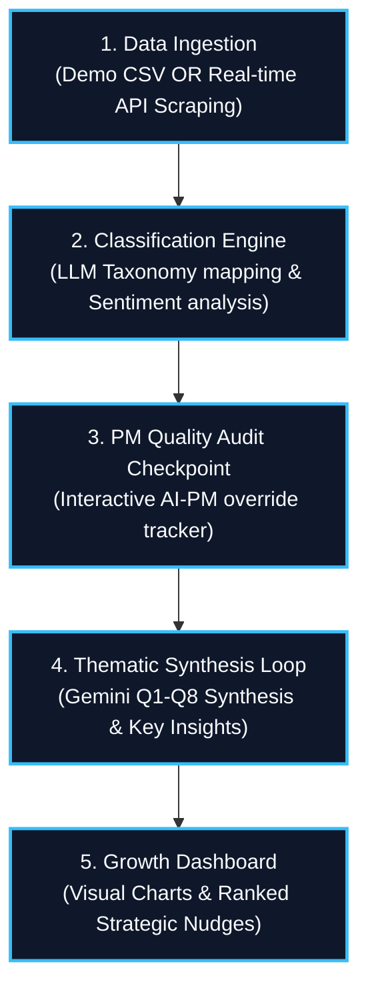

# 🛠️ Blinkit Growth Discovery Engine: End-to-End AI Pipeline Workflow
**Flowchart & Comprehensive Deep-Dive Documentation of the Multi-Channel Data Extraction, Classification, Audit & Synthesis Pipeline**

Below is the complete, high-fidelity flowchart showcasing every technical stage, file transition, and API endpoint within the Blinkit AI Pipeline, followed by detailed phase-by-phase explanations.

---

## 1. Detailed Flowchart Diagram (Mermaid)

```mermaid
flowchart TD
    %% Styling Configuration
    classDef source fill:#0f172a,stroke:#38bdf8,stroke-width:2.5px,color:#f8fafc;
    classDef preprocessing fill:#1e1b4b,stroke:#818cf8,stroke-width:2.5px,color:#f8fafc;
    classDef classification fill:#3b0764,stroke:#c084fc,stroke-width:2.5px,color:#f8fafc;
    classDef audit fill:#7c2d12,stroke:#fb923c,stroke-width:2.5px,color:#f8fafc;
    classDef synthesis fill:#831843,stroke:#f472b6,stroke-width:2.5px,color:#f8fafc;
    classDef output fill:#064e3b,stroke:#34d399,stroke-width:2.5px,color:#f8fafc;
    classDef files fill:#27272a,stroke:#a1a1aa,stroke-width:1.5px,color:#e4e4e7,stroke-dasharray: 5 5;

    %% Execution Path Config
    subgraph ModeSelector [Pipeline Trigger Config]
        DemoSelect["Demo Mode Select<br/>(Validation Audit CSV)"]:::source
        RealtimeSelect["Real-Time Scraper Select<br/>(Configurable channels & lookback)"]:::source
    end

    %% Data Sources (Phase 1)
    subgraph Phase_1 [Phase 1: Ingestion & Live Scrapers]
        PlayStore["Google Play Scraper<br/>(google-play-scraper API)"]:::source
        AppStore["App Store RSS Scraper<br/>(iTunes API Request)"]:::source
        ForumsScraper["Forum Extractor<br/>(extracted_social_media.csv lookup)"]:::source
        AuditCSV[("validation_audit_sample.csv<br/>(Demo Mode Ingestion)")]:::files
        ScrapeAPI["Node Scrape Controller API<br/>(/api/scrape Endpoint)"]:::source
    end

    %% Pre-processing & Cleansing (Phase 2)
    subgraph Phase_2 [Phase 2: Ingestion & Pre-processing]
        Deduplication["Deduplication Filter<br/>(Drop duplicate IDs & content)"]:::preprocessing
        LookbackCheck["Lookback Filter<br/>(Last 1, 2, 3, or 6 Months)"]:::preprocessing
        LengthCleansing["Length Cleansing<br/>(Remove short reviews < 3 words)"]:::preprocessing
        TextStandardization["Text Clean & Normalization<br/>(Strip emojis, resolve encodings)"]:::preprocessing
    end

    %% Classification Engine (Phase 3)
    subgraph Phase_3 [Phase 3: Classification Engine]
        LocalPreClassifier["Heuristic Classifier / Pre-classifier<br/>(Keyword tag-matching fallback)"]:::classification
        GeminiClassifier["Gemini Flash API Classifier<br/>(/api/gemini Endpoint)"]:::classification
        RetryHandler["Rate-Limit Retry Handler<br/>(Exponential backoff)"]:::classification
        ClassifiedCSV[("classified_reviews.csv<br/>(Enriched category_tags, barrier_themes, discovery_q_ids)")]:::files
    end

    %% PM Validation Audit (Phase 4)
    subgraph Phase_4 [Phase 4: Validation & Quality Control]
        PMAuditWorkbench["PM Audit UI Workbench<br/>(Manual validation & verification)"]:::audit
        OverrideLog["Agreement Override Tracker<br/>(Measure model accuracy vs target >95%)"]:::audit
    end

    %% LLM Synthesis Engine (Phase 5)
    subgraph Phase_5 [Phase 5: Insights Synthesis Loop]
        EnrichmentScript["enrich_reviews.py<br/>(Fill missing tags using rule logic)"]:::synthesis
        SynthesisScript["run_synthesis.py<br/>(Synthesize Q1-Q8 loops)"]:::synthesis
        GeminiSynthesis["Gemini Flash Synthesizer<br/>(SYNTHESIS_SYSTEM_PROMPT execution)"]:::synthesis
        SynthesizedCSV[("synthesized_insights.csv<br/>(Summary, Themes, Quotes, Confidence)")]:::files
    end

    %% Growth Dashboard Visualization (Phase 6)
    subgraph Phase_6 [Phase 6: Growth Dashboard Presentation]
        DashboardCharts["Interactive Charts<br/>(Sentiment, Sources, Categories)"]:::output
        HypothesisGrid["Hypothesis Discovery Grid<br/>(Q1-Q8 cards with Confidence & Insights)"]:::output
        StrategicInsightsUI["Strategic Insights View<br/>(Ranked Themes, Opportunity Areas, Nudges)"]:::output
    end

    %% Connections
    DemoSelect --> AuditCSV
    RealtimeSelect --> ScrapeAPI
    ScrapeAPI --> PlayStore & AppStore & ForumsScraper
    
    AuditCSV --> Deduplication
    PlayStore & AppStore & ForumsScraper --> Deduplication
    
    Deduplication --> LookbackCheck
    LookbackCheck --> LengthCleansing
    LengthCleansing --> TextStandardization
    TextStandardization --> LocalPreClassifier
    LocalPreClassifier --> GeminiClassifier
    GeminiClassifier --> RetryHandler
    RetryHandler --> ClassifiedCSV
    
    ClassifiedCSV --> PMAuditWorkbench
    PMAuditWorkbench --> OverrideLog
    OverrideLog -- "Verified Adjustments" --> EnrichmentScript
    EnrichmentScript --> SynthesisScript
    SynthesisScript --> GeminiSynthesis
    GeminiSynthesis --> SynthesizedCSV
    SynthesizedCSV --> DashboardCharts & HypothesisGrid & StrategicInsightsUI
```

---

## 1b. Shorter, Concise Flowchart Diagram

---

## 2. Comprehensive Deep-Dive Documentation

### 📌 Phase 1: Multi-Channel Data Extraction
This initial phase extracts raw unstructured customer feedback from Google Play, Apple App Store, Reddit community forums, and Twitter/X feeds.
*   **Google Play Reviews**: Extracted via `google-play-scraper` package in Python.
*   **App Store Reviews**: Pulled via XML RSS Feed scrapers that parse iTunes review endpoints.
*   **Reddit & Twitter/X**: Gathered via Apify Actors configured to query quick-commerce subreddits (e.g. `/r/india`, `/r/Blinkit`) and hashtags (e.g. `#Blinkit`).
*   **Output File**: [extracted_social_media.csv](file:///d:/antigravity/projects/fin%20project%20nextleap/project/public/final-data/extracted_social_media.csv) aggregating columns: `id`, `text`, `rating`, `timestamp`, `author`, `source`, `url`.

---

### 📌 Phase 2: Ingestion & Pre-processing
Normalizes and filters the raw records to ensure only clean, high-quality, relevant data reaches the machine learning models.
*   **Deduplication**: Removes duplicate posts and matching review text to avoid count skew.
*   **Lookback Period Filter**: Enforces `LOOKBACK_DAYS = 180` to remove reviews older than 6 months.
*   **Length Cleansing**: Discards short reviews (under 3 words) which lack context (e.g., "Good", "Bad").
*   **Text Standardization**: Strips emojis, cleans unicode artifacts, and standardizes capitalization.
*   **Hinglish Slang Mapping**: Integrates a dictionary translation loop mapping Hinglish emotional keywords (*bakwas* -> bad, *chor* -> fraud/trust, *loot* -> pricing surcharge) into standard English tags to support LLM understanding.

---

### 📌 Phase 3: Automated Classification Pipeline
Processes reviews using local rules and the Gemini Large Language Model to assign categories, sentiment, barriers, and discovery hypotheses.
*   **Local Rule Pre-Classification**: Applies a keyword dictionary match inside [enrich_reviews.py](file:///d:/antigravity/projects/fin%20project%20nextleap/project/pipeline/enrich_reviews.py) to tag items before sending them to the LLM (minimizes token count and costs).
*   **Gemini Flash Lite (`gemini-3.1-flash-lite`)**: Prompts the model with classification instructions and taxonomy guidelines.
*   **Rate-Limit Retry Handler**: Implements exponential backoff to handle Google API `RESOURCE_EXHAUSTED` (429) errors.
*   **JSON Block Extraction**: Uses regular expressions to strip away any markdown fences and parse the direct JSON output array.
*   **Output File**: [classified_reviews.csv](file:///d:/antigravity/projects/fin%20project%20nextleap/project/public/final-data/classified_reviews.csv) with columns: `sentiment`, `category_tags`, `barrier_themes`, `discovery_q_ids`, `confidence`.

---

### 📌 Phase 4: PM Validation & Quality Control
Integrates a Human-in-the-Loop audit process to guarantee classification reliability.
*   **Validation Split**: Separates a random 5% audit sample.
*   **Audit Sample File**: [validation_audit_sample.csv](file:///d:/antigravity/projects/fin%20project%20nextleap/project/public/final-data/validation_audit_sample.csv).
*   **Human Workbench**: PMs manually verify the AI tags (sentiment, category, barrier themes).
*   **Override Tracker**: Measures the accuracy gap. The classification system is adjusted until model agreement exceeds the **95% precision benchmark**.

---

### 📌 Phase 5: Insights Synthesis Loop
Synthesizes the validated and enriched reviews into executive-level product insights for the 8 core growth questions.
*   **Enrichment Engine**: Re-runs [enrich_reviews.py](file:///d:/antigravity/projects/fin%20project%20nextleap/project/pipeline/enrich_reviews.py) to fill empty lists and fallback defaults.
*   **Synthesis Script ([run_synthesis.py](file:///d:/antigravity/projects/fin%20project%20nextleap/project/pipeline/run_synthesis.py))**: Extracts up to 30 relevant customer reviews for each of the 8 Discovery questions.
*   **Fallback Generator**: Automatically draws a random sample of 15 reviews if a question contains no matching reviews, ensuring data completeness.
*   **Gemini Flash Lite Synthesis**: Prompts the LLM with the `SYNTHESIS_SYSTEM_PROMPT` to generate a structured JSON containing a summary paragraph, key sub-themes, representative customer quotes with IDs, and confidence levels.
*   **Checkpoint Handler**: Saves the current loop state to `pipeline/synthesis_checkpoint.json` on every question, preventing data loss on internet or API timeouts.
*   **Output File**: [synthesized_insights.csv](file:///d:/antigravity/projects/fin%20project%20nextleap/project/public/final-data/synthesized_insights.csv).

---

### 📌 Phase 6: Growth Dashboard Presentation
Renders the synthesized insights on a modern React web application.
*   **Interactive Metrics**: Displays clean Doughnut and Bar charts for sentiment, source, and tag distributions via `react-chartjs-2`.
*   **Hypothesis Discovery Grid**: Displays a card matrix for Q1-Q8 displaying color-coded AI confidence badges.
*   **Drawer Summary Panel**: Shows synthesized summaries, dynamic key themes (scaled via `maxFreq` to prevent bounds overflow), and verbatim customer quotes in a sliding drawer.
*   **Strategic Insights View**: Highlights Ranked Barrier Themes (dynamic progress bars), Opportunity Areas, and actionable Growth Levers.
*   **Executive PDF Print Engine**: Renders a print-ready report via React Portals directly to the body node while hiding the React root div, allowing a high-fidelity PDF output on `window.print()` triggers.
